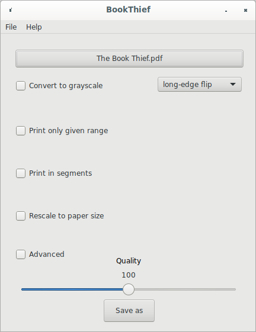
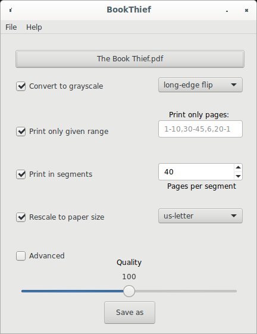

# BookThief

BookThief prepares PDFs to be home-printed and home-bound in "pamphlet"-style.

    For those of us who prefer print over screens

> Rudy said, "You know something, Liesel, I was thinking. You’re not a thief at all. Stealing is what the army does. Taking your father, and mine." He kicked a stone and it clanged against a gate. He walked faster. "All those rich Nazis up there, on Grande Strasse, Gelb Strasse, Heide Strasse. How does it feel anyway?"
>
> "How does what feel?"
>
> "When you take one of those books?"
>
> At that moment, she chose to keep still. If he wanted an answer, he'd have to come back, and he did.
>
> "Well?" he asked, but again, it was Rudy who answered, before Liesel could even open her mouth.
>
> "It feels good, doesn't it? To steal something back."

– Markus Zusak's "The Book Thief"

## Installation

64-bit .deb packages & Windows installer files are provided in the **releases** section

On **Debian GNU/Linux**, BookThief can be easily installed via the [deb.rail5.org](https://deb.rail5.org) repository:

```
sudo curl -s -o /etc/apt/trusted.gpg.d/rail5-signing-key.gpg "https://deb.rail5.org/rail5-signing-key.gpg"
sudo curl -s -o /etc/apt/sources.list.d/rail5.list "https://deb.rail5.org/debian/rail5.list"
sudo apt update
sudo apt install bookthief
```

## About

BookThief is a graphical front-end for [Liesel](https://github.com/rail5/liesel)

This is **free software** (GNU GPL 3), and you are welcome to redistribute it under certain conditions.

## What is "pamphlet"-style printing?

When BookThief spits out a new/converted PDF, you simply print it at home, double-sided, and then fold the stack of papers in half. (And staple them, if you want)






## Features

- GUI (bookthief) & command-line (liesel)

- Supports "splitting" PDFs into more manageable segments (based on how much paper you can realistically staple together)

- Has an "advanced" window featuring a live-preview of the current settings

## Advanced Window

Suppose you're handling a PDF of a scanned book with yellow pages:


You can apply the "color threshold" to save ink when printing:


Suppose instead you're handling a PDF of another scanned book, but the scanner didn't separate the left/right pages


Normally, this would mess things up pretty bad


But we can apply the "Split pages" option to fix it for us


## Build Requirements

- FPC (FreePascal Compiler) (>= 3.2.0) (Package: **fpc-3.2.0**)
- Lazarus (= 2.0.10) (Package: **lazarus**)
- **lcl-2.0**
- **lcl-utils-2.0**
- **fp-units-misc-3.2.0**

## Building
```
make
sudo make install
```

Note that BookThief **will build** without Liesel, but it will not **run** without Liesel.

If you install BookThief via the PPA, Liesel comes with it in the same PPA. Otherwise, the source for Liesel can be obtained here: https://github.com/rail5/liesel
## License

BookThief & Liesel are **free software**, distributed under the GNU GPL V3.0 License

