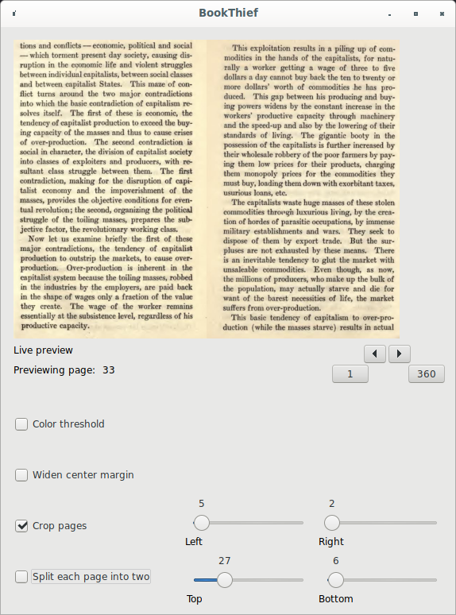
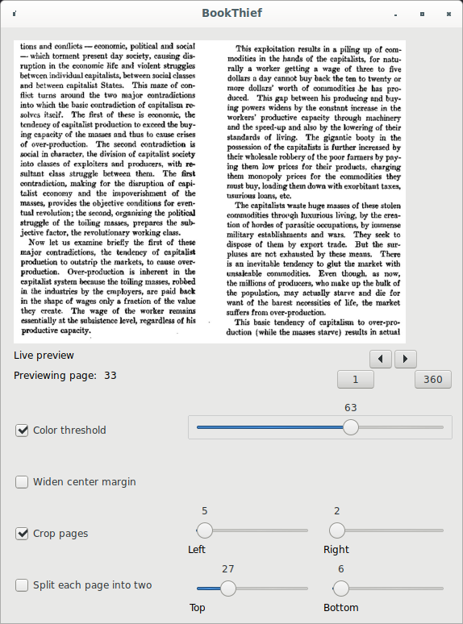
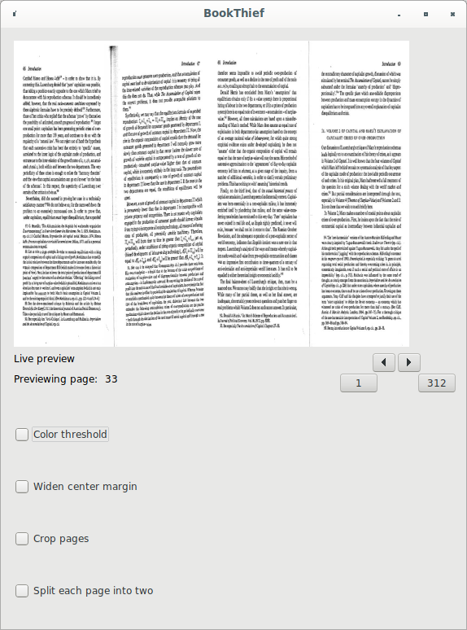

# BookThief

BookThief prepares PDFs to be home-printed and home-bound in "pamphlet"-style.

    For those of us who prefer print over screens

## Installation

On Ubuntu-based distros, BookThief can be easily installed via the BookThief PPA:

```
sudo add-apt-repository ppa:rail5/bookthief
sudo apt-get update
sudo apt-get install bookthief
```

## What is "pamphlet"-style printing?

When BookThief spits out a new/converted PDF, you simply print it at home, double-sided, and then fold the stack of papers in half. (And staple them, if you want)


## Features

- GUI (bookthief) & command-line (liesel)

- Supports "splitting" PDFs into more manageable segments (based on how much paper you can realistically staple together)

- Has an "advanced" window featuring a live-preview of the current settings

## Advanced Window

Suppose you're handling a PDF of a scanned book with yellow pages:



You can apply the "color threshold" to save ink when printing:



Suppose instead you're handling a PDF of another scanned book, but the scanner didn't separate the left/right pages


Normally, this would mess things up pretty bad



But we can apply the "Split pages" option to fix it for us


## Build Requirements

- FPC (FreePascal Compiler) (>= 3.2.0) (Package: **fpc-3.2.0**)
- Lazarus (= 2.0.10) (Package: **lazarus**)
- **lcl-2.0**
- **lcl-utils-2.0**
- **fp-units-misc-3.2.0**

## Building
```
make
sudo make install
```

Note that BookThief **will build** without Liesel, but it will not **run** without Liesel.

If you install BookThief via the PPA, Liesel comes with it in the same PPA. Otherwise, the source for Liesel can be obtained here: https://github.com/rail5/liesel
## License

BookThief & Liesel are **free software**, distributed under the GNU GPL V3.0 License

